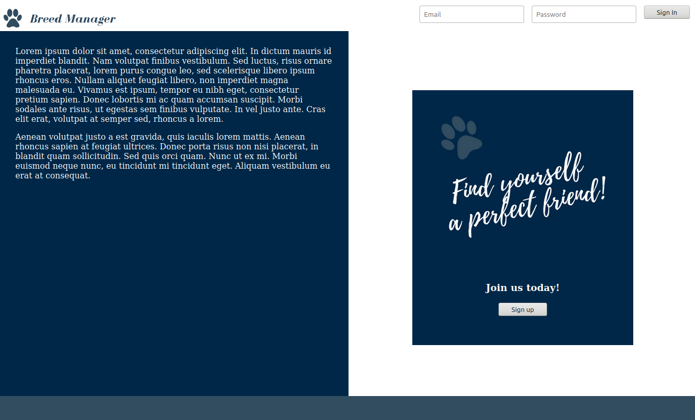
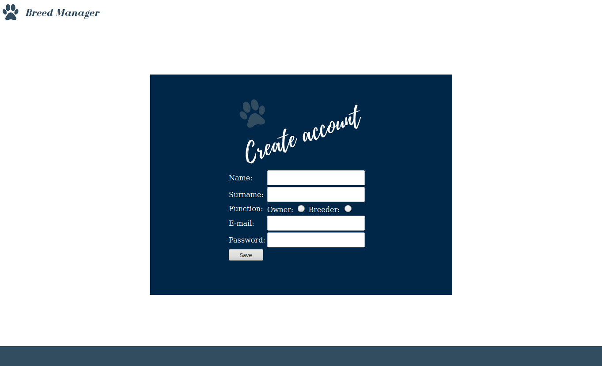

## Project name

# BreedManager

## General info

A simple web-app that in the assumption helps with managing of dogs breeding.
Created as a final project in programming course.
Still developed as a field to learn new features and tehnologies.

## Screenshots

## Technologies

* Java - version 1.8
* SpringBoot - version 2.2.5.RELEASE
* SpringData - version 2.2.5.RELEASE
* SpringSecurity - version 2.2.5.RELEASE
* JUnit - version 5.6.0
* Mockito - version 3.2.4
* MySQL - version 14.14 

## Features

* Creating and managing of User accoun (CRUD)
* Adding fully functionall CRUD for Dog and Breeding entitis
* saving data based on ORM (Hibernate)
* Searching for available puppies
* Simple messaging between users
* Basic unit tests for Services

## To-do list

* Add messaging based on RabbitMQ
* Change the simple, based on JSP frontend  files to a Angular 2
* Add cookies and sessions
* Add confirmation email in registration process

## Status

Project is: _in progress
